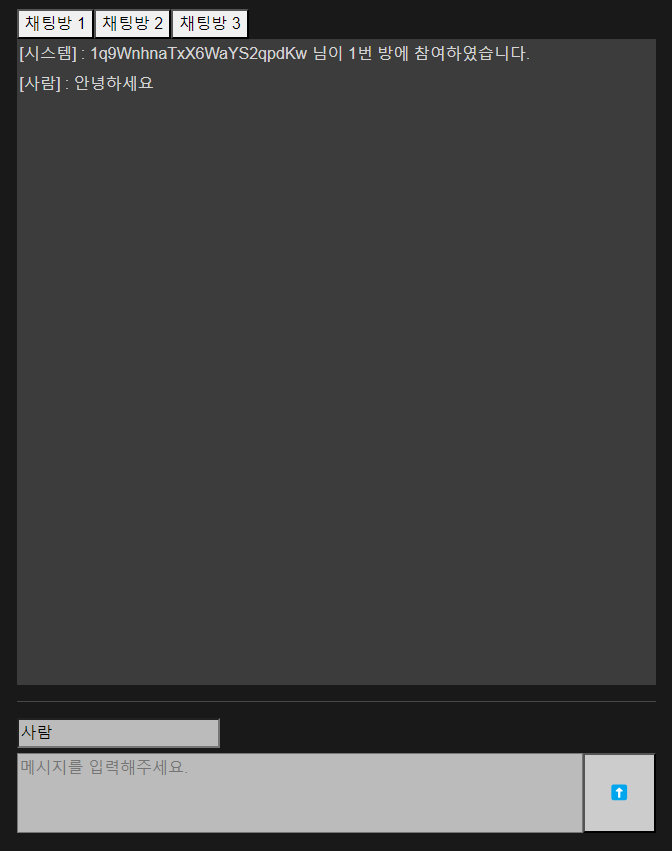
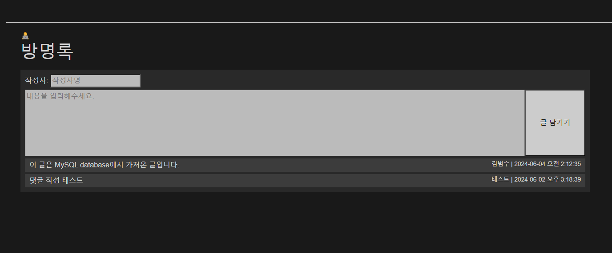

# blazor-mini

간단한 웹소켓 채팅과 방명록

# 사용 기술

- Blazor Server (ASP.NET)
- MySQL

## 주요 기능

### 채팅

- 사용자명을 정하고 채팅방을 선택하여 실시간 채팅을 전송/수신
- 채팅방끼리는 채널이 서로 분리되어 있음

채팅을 위한 통신은 아래의 과정을 거칩니다.
- signalR 클라이언트에서 서버의 허브에 연결과 콜백을 설정
- 허브에서 이벤트별 처리를 구현하고 허브를 등록

### 방명록

- 작성자명과 방명록 내용을 작성 후 글 남기기
- 그냥 DB를 붙여보고 싶었음
